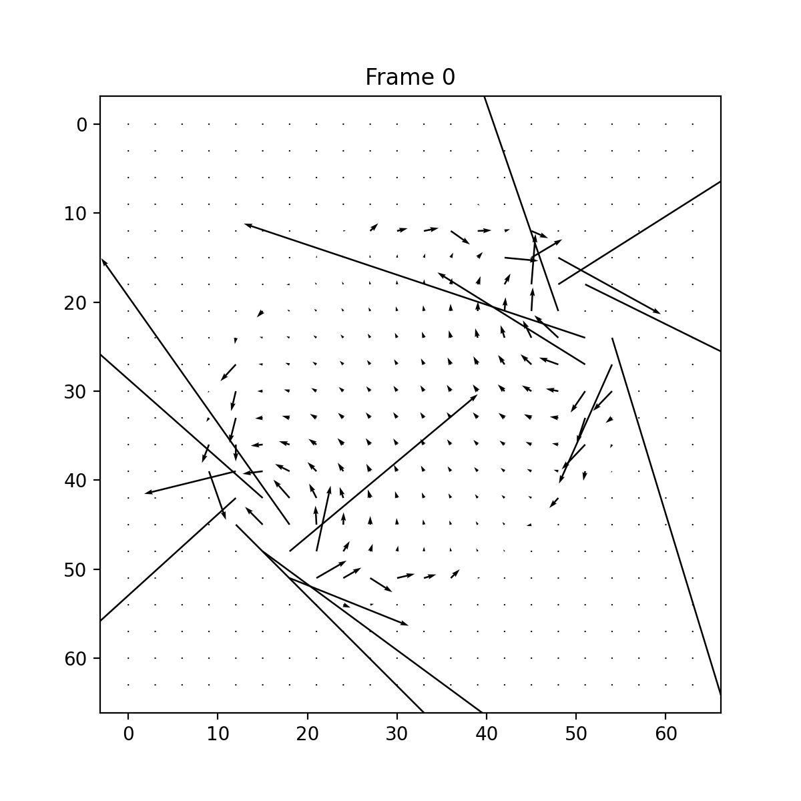
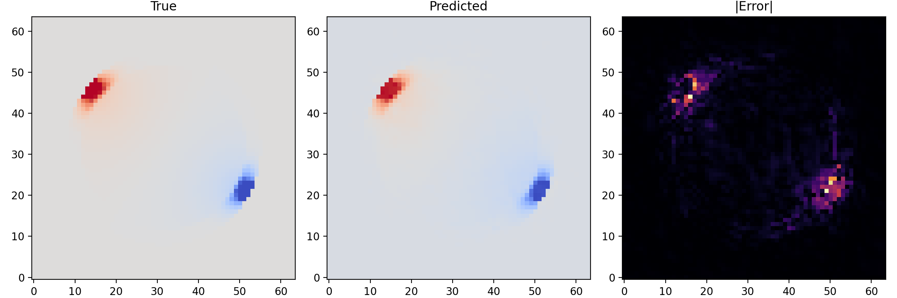

# 📘 **BrainField-Operator**

*A Physics-Informed Neural Operator Framework for Bioelectromagnetic Brain Field Modeling*

---

## 🧠 Overview

**BrainField-Operator** is a research-grade framework for simulating and learning **electric brain fields** induced by external stimulation (e.g., tDCS/tACS).
It integrates:

* **PDE-based biophysical modeling** using the Poisson equation
* **Layered head geometry** (brain–skull–scalp)
* **Electric field computation**
* **Neural Operator surrogate learning** using Fourier Neural Operators (FNO)
* **High-quality visualization and animation tools**

Preprint : https://doi.org/10.5281/zenodo.17685776

This project bridges **computational physics + PDE modeling** with **computational neuroscience and neurotechnology**, closely aligned with research such as:

> *Biophysical modeling of electrical brain signals and the influence of external electromagnetic fields on neural dynamics.*

---

## 🚀 Features

### 🔹 **1. Biophysical PDE Simulation**

Solves:
[
\nabla \cdot (\sigma \nabla V) = 0
]
on layered head structure:

* Brain
* Skull
* Scalp

with realistic conductivity contrasts.

### 🔹 **2. Electrode-Based Stimulation**

* Randomized anode/cathode electrode placement
* Variable potential distributions
* tDCS-like field induction

### 🔹 **3. Neural Operator Surrogate**

* Built-in **FNO2D** implementation
* Optional **UNet2D baseline**
* Fast surrogate for PDE solver
* Trained to approximate ( V(x,y) )

### 🔹 **4. Dataset Pipeline**

* Generate 100–10,000 synthetic PDE samples
* Save to compressed `.npz`

### 🔹 **5. Visualization + Animation**

* Potential maps
* Electric field quiver (Ex, Ey)
* PDE vs Surrogate comparison
* GIF / MP4 animations

---

## 📂 Project Structure

```
brainfield-operator/
│
├── brainfield_operator/
│   ├── pde/               # Geometry, electrodes, conductivities, solver
│   ├── data/              # Dataset generator + PyTorch Dataset
│   ├── models/            # FNO2d, UNet2D
│   ├── training/          # Train + evaluation loops
│   ├── visualization/     # Plots, quiver, animations
│   ├── utils/             # Logging, IO, seed
│   └── config.py
│
├── experiments/
│   ├── exp_fno_training.yaml
│   └── exp_unet_training.yaml
│
├── data/                  # (ignored) Generated PDE datasets
├── checkpoints/           # (ignored) Trained model weights
├── figures/               # (ignored) Output figures (PNGs / GIFs)
│
├── generate_dataset.py
├── train_operator.py
├── eval_operator.py
├── animate_comparison.py
├── animate_efield.py
└── README.md
```

---

# 🔧 Installation

```bash
git clone <repo-url>
cd brainfield-operator

python3.11 -m venv .venv
source .venv/bin/activate

pip install -r requirements.txt
```

Minimal `requirements.txt`:

```
numpy
matplotlib
torch
pyyaml
```

---

# 🧪 1. Generate PDE Dataset

```bash
python generate_dataset.py \
    --n_samples 200 \
    --output_dir data/brainfield
```

Each `.npz` contains:

* `sigma`
* `electrode_potential`
* `V` (potential field)
* `Ex`, `Ey` (electric field components)

---

# 🎓 2. Train Neural Operator Surrogate

### ➤ Simple FNO training

```bash
python train_operator.py \
    --data_dir data/brainfield \
    --model_type fno2d \
    --batch_size 8 \
    --lr 1e-3 \
    --num_epochs 50 \
    --device cuda
```

### ➤ Using a YAML config

```bash
python train_operator.py \
    --data_dir data/brainfield \
    --config experiments/exp_fno_training.yaml
```

Best model checkpoints are saved in:

```
checkpoints/best_model_epochXX.pt
```

---

# 📈 3. Evaluation & Visual Results

### ➤ Generate comparison plot

```bash
python eval_operator.py \
    --data_dir data/brainfield \
    --checkpoint checkpoints/best_model_epoch50.pt \
    --model_type fno2d \
    --index 0 \
    --save_path figures/comparison_example.png
```

---

## 🖼 Example Output

> **Actual figure is generated from your model — your result is shown below.**

### **Ground Truth vs Predicted vs Error Map**


(Your actual image should be placed here.
You can also embed the two images you uploaded:)

<!-- **Sample 1**


**Sample 2**

 -->

### Example: Ground Truth vs Prediction


### Additional Samples


### Electric Field Animation



---

# 🎞 4. Animations


### ➤ Comparison GIF (PDE vs Prediction)

```bash
python animate_comparison.py \
    --data_dir data/brainfield \
    --checkpoint checkpoints/best_model_epoch50.pt \
    --num_frames 15 \
    --save_path figures/comparison.gif
```

### ➤ Electric Field GIF (Ex, Ey)

```bash
python animate_efield.py \
    --data_dir data/brainfield \
    --checkpoint checkpoints/best_model_epoch50.pt \
    --num_frames 15 \
    --save_path figures/efield.gif
```

---

# 🧠 Scientific Motivation

Stimulation techniques such as **tDCS** induce weak electric fields across brain tissue.
These fields depend strongly on:

* head geometry
* conductivity contrasts
* electrode position
* applied potential

Modeling such fields is essential for:

* neurotechnology
* brain–computer interfaces
* computational neuroscience
* bioelectromagnetics research

This project demonstrates:

### ✔ PDE modeling skills

### ✔ Computational physics background

### ✔ Experience in neural operators

### ✔ Ability to integrate physics + ML

### ✔ Direct relevance to brain physics and neurotechnology

This aligns closely with topics such as:

* EEG/MEG forward models
* transcranial stimulation modeling
* computational neurophysics
* ML-based surrogate modeling for PDEs

---

# 📜 Citation

If you use this framework, please cite:

```
Octaviani, A. (2025).
BrainField-Operator: Neural Operator Surrogates for Bioelectromagnetic Brain Field Modeling.
GitHub Repository.
```

---

# 🙋‍♀️ Author

**Aulia Octaviani**
Email: `auliaoctavvia@gmail.com`
GitHub: [aoctavia](https://github.com/aoctavia)
