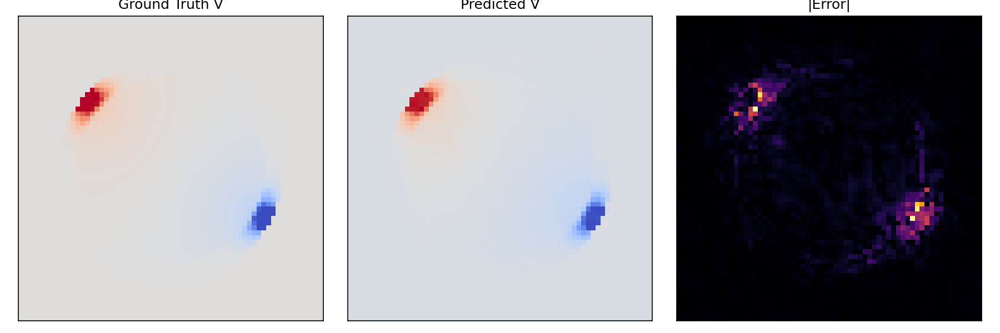

# 📘 **BrainField-Operator**

*A Physics-Informed Neural Operator for Bioelectromagnetic Brain Field Modeling*

---

## 🧠 Overview

**BrainField-Operator** adalah framework kecil namun powerful untuk memodelkan **potensial listrik dan medan elektromagnetik di otak** akibat stimulasi eksternal (misalnya tDCS/tACS), dengan menggabungkan:

* **PDE-based modeling** (Persamaan Poisson 2D)
* **Layered human head model** (brain–skull–scalp)
* **Random electrode configurations**
* **Numerical field simulation**
* **Neural Operator surrogate learning** menggunakan **Fourier Neural Operator (FNO)** atau **UNet2D**
* **Training, evaluation, visualization, and animation utilities**

Project ini dirancang sebagai *bridging project* yang menghubungkan **computational physics + neural operators** ke domain **computational neuroscience & brain physics**.

Framework ini meniru workflow riset seperti:

> *Biophysical modeling of electrical/magnetic brain signals, PDE field solvers, and machine-learning surrogate models for neurotechnology.*

---

## 🚀 Features

### 🧩 PDE Modeling (Physics)

* Solve Persamaan Poisson 2D untuk distribusi potensial listrik:
  [
  \nabla \cdot (\sigma \nabla V) = 0
  ]
* Geometry:

  * Brain
  * Skull
  * Scalp
* Conductivity contrast realistis
* tDCS-like electrode placement (random anode-cathode on scalp)

### ⚡ Electric Field Computation

* Compute:

  * Potential field **V(x, y)**
  * Electric field components **Ex, Ey = -∇V**

### 🤖 Neural Operator Surrogate

* **FNO2D** (Fourier Neural Operator)
* **UNet2D** baseline
* Train surrogate untuk memprediksi solusi PDE dalam sekali inference

### 📊 Visualization

* Potential map & field quiver
* PDE vs Surrogate comparison
* Animated GIF/MP4 visualizations

### 🧰 Complete Utilities

* Dataset generator (.npz)
* Model checkpoints
* Config YAML experiments
* Logging, seed, IO helpers

---

## 📂 Project Structure

```text
brainfield-operator/
│
├── brainfield_operator/          # Core package
│   ├── pde/                      # Geometry, electrodes, solver
│   ├── data/                     # Dataset generation + PyTorch Dataset
│   ├── models/                   # FNO2D, UNet2D
│   ├── training/                 # Train & eval loops
│   ├── visualization/            # Plots + animations
│   ├── utils/                    # Logging, IO, seed
│   └── config.py                 # Experiment configs
│
├── experiments/                  # YAML experiment configs
├── data/                         # (ignored) PDE datasets
├── checkpoints/                  # (ignored) Model weights
├── figures/                      # (ignored) Output plots
│
├── generate_dataset.py           # Script to generate PDE dataset
├── train_operator.py             # Train FNO/UNet surrogate
├── eval_operator.py              # Evaluate trained model & plot results
└── README.md
```

---

## 🔧 Installation

### 1. Clone & prepare environment

```bash
git clone <repo-url>
cd brainfield-operator

python3.11 -m venv .venv
source .venv/bin/activate

pip install -r requirements.txt
```

Minimal `requirements.txt`:

```
numpy
matplotlib
torch
pyyaml
```

---

## 🧪 1. Generate PDE Dataset

Dataset akan tersimpan dalam format `.npz`, masing-masing berisi:

* `sigma` – conductivity map
* `electrode_potential` – tDCS potential mask
* `V` – PDE potential solution
* `Ex`, `Ey` – electric field components

Jalankan:

```bash
python generate_dataset.py --n_samples 200 --output_dir data/brainfield
```

---

## 🎓 2. Train Neural Operator Surrogate

### 🔹 Simple FNO training:

```bash
python train_operator.py \
    --data_dir data/brainfield \
    --model_type fno2d \
    --batch_size 8 \
    --lr 1e-3 \
    --num_epochs 50 \
    --device cuda
```

### 🔹 Using YAML config:

```bash
python train_operator.py \
    --data_dir data/brainfield \
    --config experiments/exp_fno_training.yaml
```

Checkpoints akan otomatis tersimpan di:

```
checkpoints/best_model_epochXX.pt
```

---

## 📈 3. Evaluate & Visualize Results

```bash
python eval_operator.py \
    --data_dir data/brainfield \
    --checkpoint checkpoints/best_model_epoch50.pt \
    --model_type fno2d \
    --index 0 \
    --save_path figures/comparison_example.png
```

Ini akan menghasilkan plot seperti:

* **Ground truth PDE field**
* **Predicted neural operator field**
* **Absolute error map**

---

## 🖼 Example Output

*(Tambahkan gambar hasilmu setelah di-generate)*

```markdown

```

---

## 🧠 Scientific Motivation

Stimulation modalities seperti **tDCS** menghasilkan medan listrik yang menyebar melalui struktur anatomi otak—dipengaruhi oleh konduktivitas yang berbeda-beda (brain, skull, scalp).

Dengan memodelkan ini lewat PDE dan mempelajari surrogate neural operator:

### ✔ Kita mendapatkan solver yang jauh lebih cepat

### ✔ Bisa digunakan untuk parameter sweeps

### ✔ Berguna untuk neurotechnology & brain-interface modeling

### ✔ Ini sangat align dengan riset seperti:

* **Computational neuroscience**
* **Biophysical modeling of EEG/MEG**
* **Electromagnetic brain-field simulation**
* **Operator learning for PDEs**

Project ini dapat memperlihatkan:

* Foundation kuat di computational physics
* Pemahaman PDE & bioelectromagnetics
* Experience neural operator modeling
* Skill HPC / scientific ML

---

## 🤝 Contact

Aulia Octaviani
GitHub: **aoctavia**
Email: **[auliaoctavvia@gmail.com](mailto:auliaoctavvia@gmail.com)**